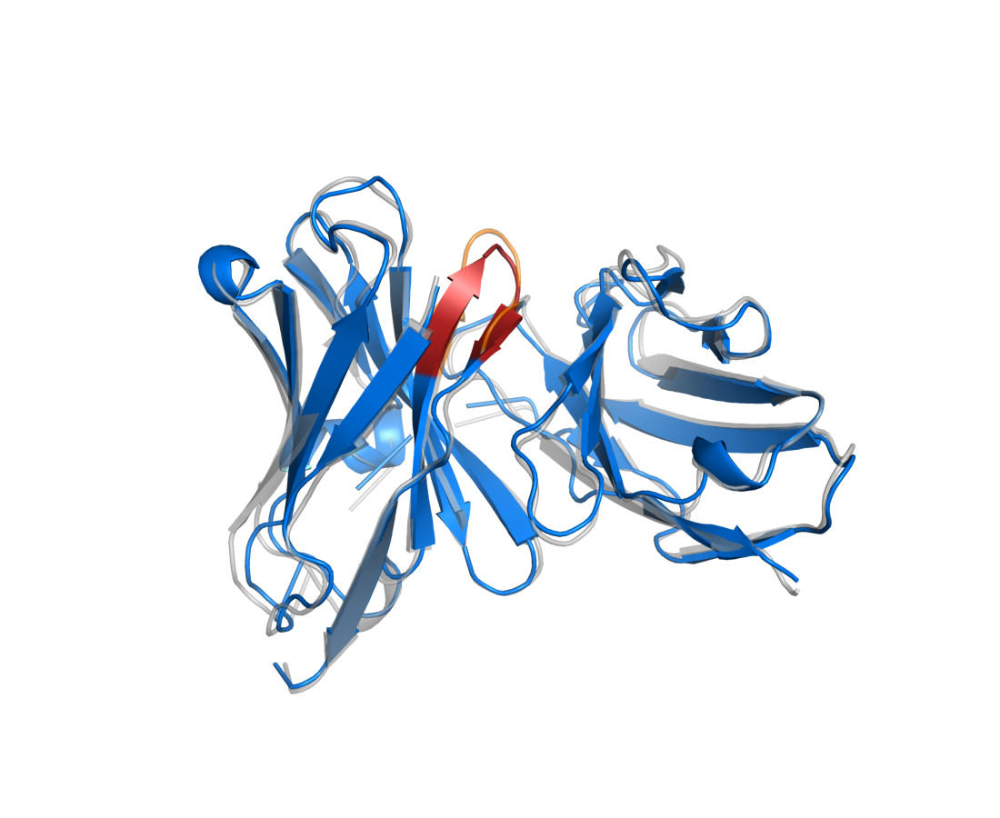
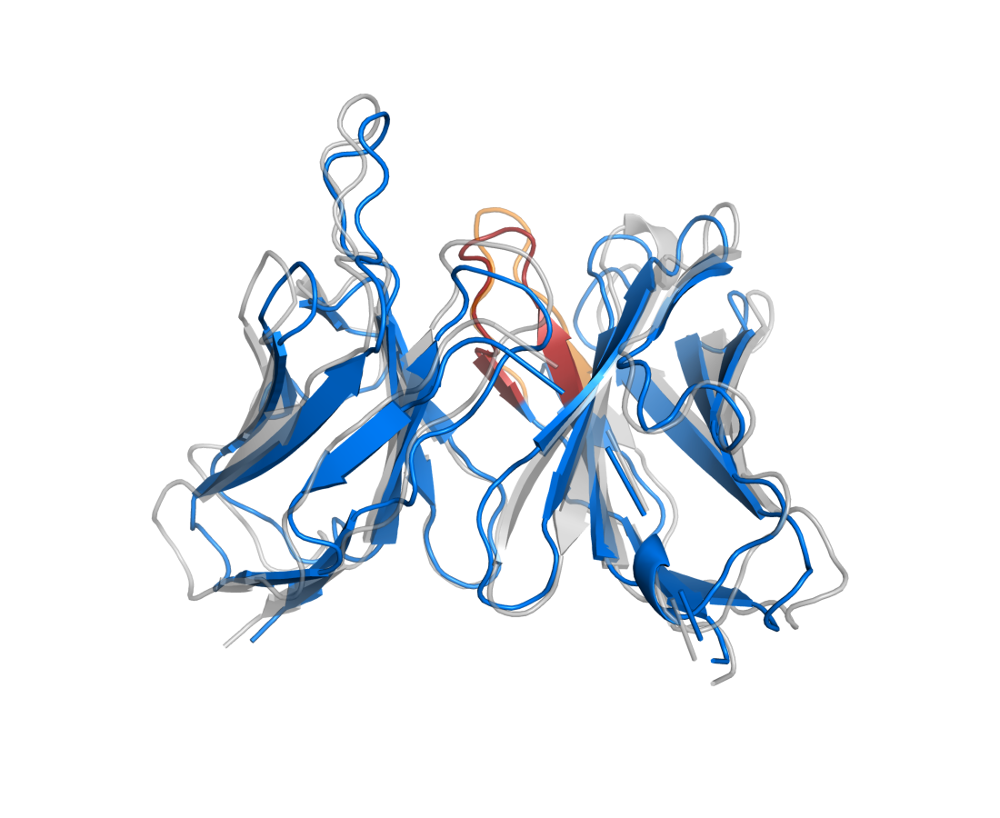
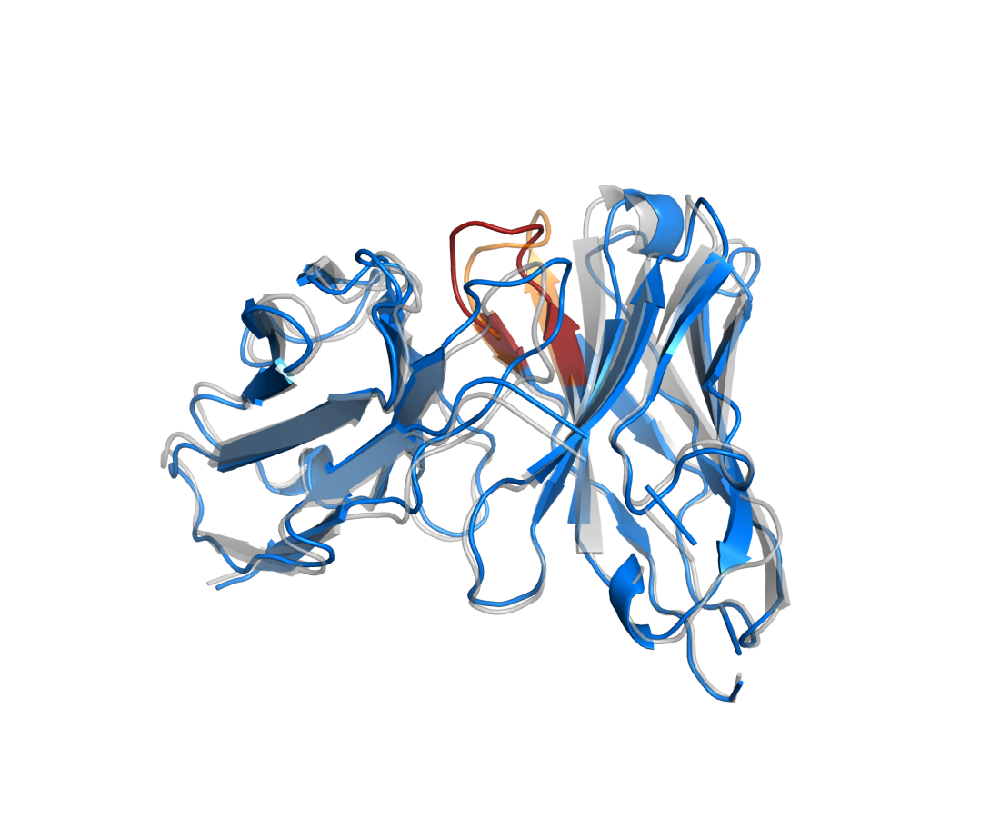
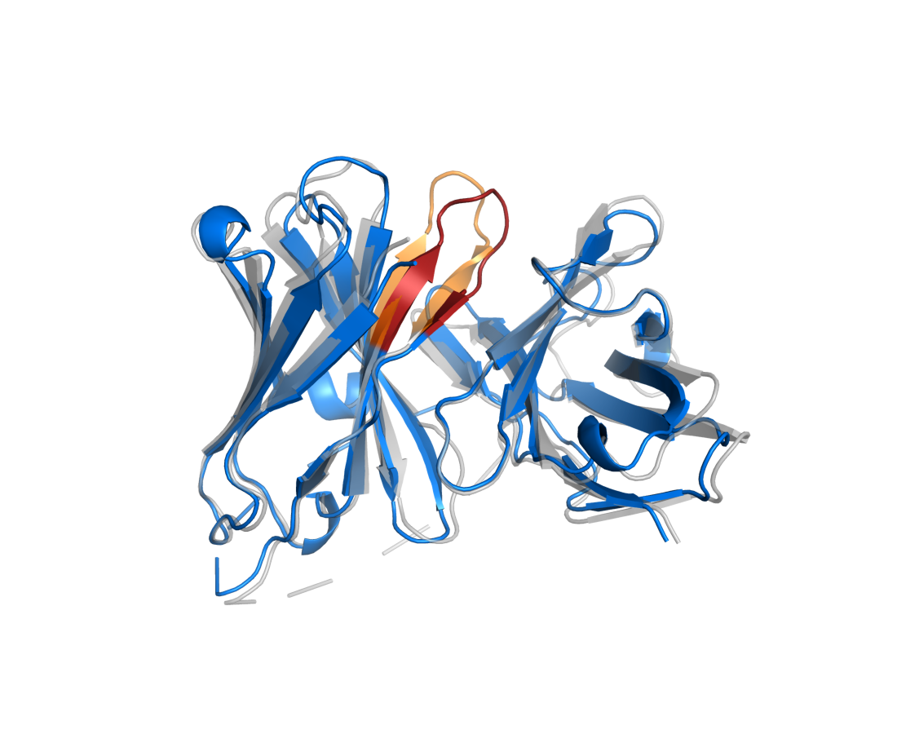
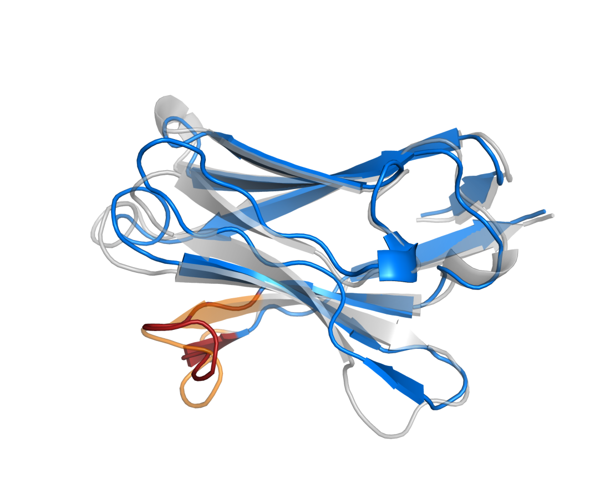
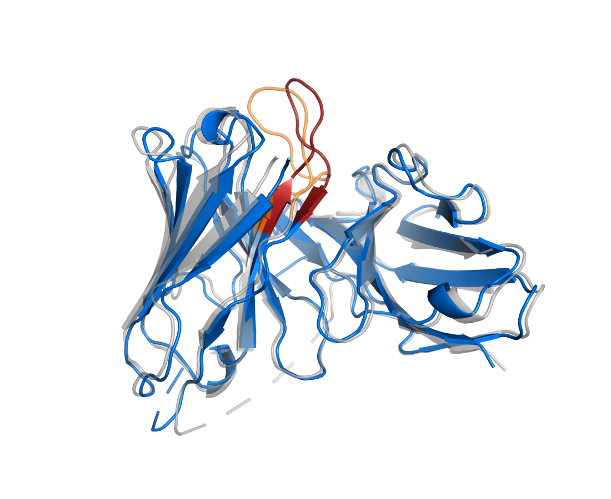
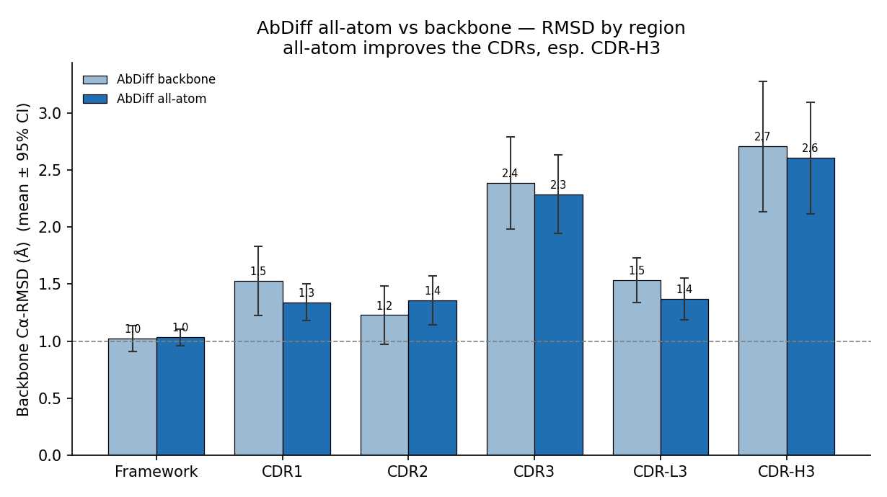
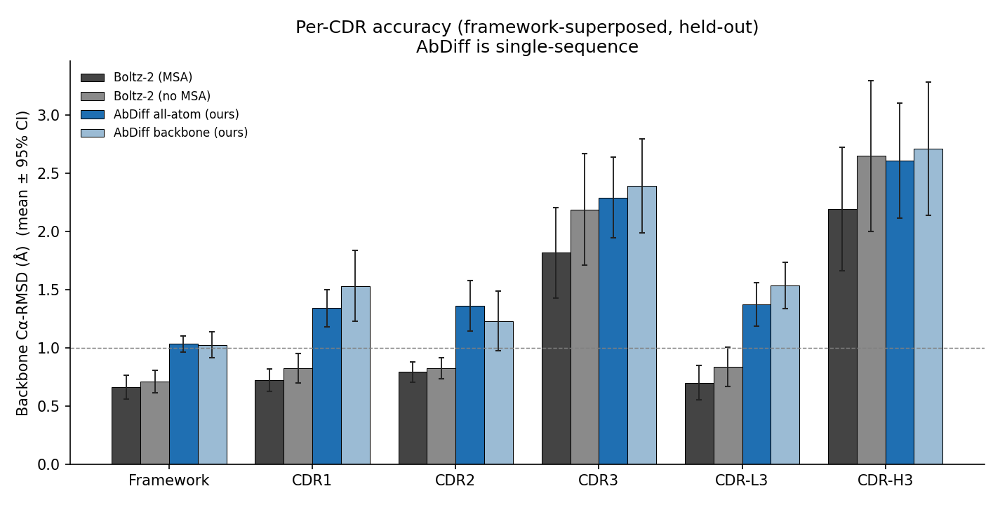
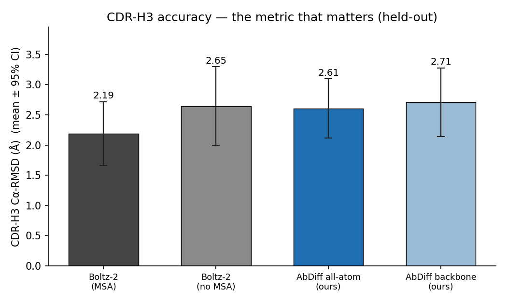

# AbDiff

**AF3-style antibody structure prediction by R³ coordinate diffusion of protein-language-model embeddings.**

AbDiff predicts antibody **Fv structure** directly from sequence by *diffusing* a frozen antibody-pLM
(AntiBERTy) embedding into 3D coordinates. The diffusion follows the AlphaFold3 / OpenFold3 recipe —
**EDM coordinate diffusion in Euclidean R³ with no SO(3)/frame representation** — but the heavy
MSA + Evoformer trunk is replaced by a frozen pLM and a thin pair stack. One representation handles
**paired Fab/Fv, scFv, and heavy-chain-only (VHH / nanobody)** antibodies with no architectural changes.

Two output modes share the same architecture:
- **backbone** — 4 atoms/residue (N, Cα, C, O);
- **all-atom** — 14 atoms/residue (AlphaFold **atom14**, with sidechains), CA at index 1.

**Headline (apples-to-apples):** in the **single-sequence (no-MSA) regime, AbDiff matches Boltz-2.**
On held-out CDR-H3, AbDiff all-atom = **2.61 Å** vs **Boltz-2 no-MSA = 2.65 Å** (overlapping 95% CIs).
Boltz-2's full edge comes from MSAs (**2.65 → 2.19 Å with MSAs**), which AbDiff doesn't use — at 14.5M params.

> Status: research preview. Trained on ~15k SAbDab Fvs; ~14.5M params (also a 50.9M variant).

---

## Architecture


```
sequence ─► AntiBERTy (frozen, 512-d) ─► single rep s ─┐
         └► ANARCI (IMGT) Fv-trim + CDR labels          ├─► DiffusionModule (R³, EDM) ─► backbone x̂
  relpos + outer-product + Pairformer ─► pair rep z ─────┘   (atom-attn ▸ diff-transformer ▸ atom-attn)
            noisy coords xₜ , noise level t  ───────────────►
```

- **No SO(3) / frames.** Coordinates are denoised directly in R³ with EDM preconditioning
  (`x̂ = c_skip(t)·xₜ + c_out(t)·F`). Global pose freedom is handled by random-rotation augmentation
  of the target plus a Kabsch-aligned loss — not by manifold diffusion.
- **Frozen pLM trunk.** All sequence/evolutionary knowledge comes from AntiBERTy; the 14.5M-param
  diffusion network only learns embedding → geometry. (Swappable: ESM2, AbLang2, IgBert.)
- **Format-agnostic.** Fab = 2 chains (asym 0/1), scFv = 1 chain with 2 V-domains, VHH = 1 chain —
  all expressed purely through per-token `asym_id` / `residue_index` features.

## Results

Full 200-step rollout from noise, framework-superposed, best-of-4. Bars are **mean ± 95% CI**.


| Region | In-distribution held-out (n=30) | **OOD — never-trained PDBs** (n=56) |
|---|---|---|
| Framework | 1.0 | 1.2 |
| CDR-L3 | 1.5 | 1.4 |
| CDR-1 / CDR-2 | 1.5 / 1.2 | 1.8 / 1.6 |
| **CDR-H3** | **2.99** | **3.37** |

**Two honest takeaways:**
1. The conserved framework is *easy* (~1 Å); whole-Fv RMSD is flattered by it. The number that
   matters is **CDR-H3 ≈ 3 Å** — the long, hypervariable, binding-critical loop every antibody method
   is judged on. AbDiff is *single-sequence* (no MSA), so ~3 Å H3 is a reasonable starting point.
2. **It generalizes.** On a disjoint set of antibodies (>3.5 Å SAbDab entries — entirely different
   PDBs from the 9,119 trained on), CDR-H3 only rises 2.99 → 3.37 Å (overlapping CIs), and the OOD
   set has softer ground-truth coordinates, so the true gap is even smaller. Not memorization.

### Predicted (blue) vs native (gray), CDR-H3 in red/orange — PyMOL ray-traced, framework-superposed
| | | |
|---|---|---|
|  |  |  |
| Fab, H3 ≈ 0.8 Å | Fab, H3 ≈ 0.9 Å | Fab, H3 ≈ 1.1 Å |
|  |  |  |
| Fab, H3 ≈ 2.1 Å | Fab, H3 ≈ 1.7 Å | **VHH/nanobody**, H3 ≈ 1.4 Å |
|  |  |  |
| Fab, H3 ≈ 2.2 Å | Fab, H3 ≈ 6.1 Å (hard) | Fab, H3 ≈ 6.2 Å (hard) |

The β-sandwich framework superposes tightly across all cases; CDR-H3 is where prediction and native diverge.

### All-atom predictions (atom14, with sidechains)
The all-atom model outputs a complete structure — backbone **and sidechains**, real residue identities
(no GLY placeholders). Predicted (blue) vs native (gray), CDR-H3 red/orange, PyMOL ray-traced:

| | | |
|---|---|---|
|  |  |  |
|  |  (VHH) |  (hard H3) |

All 30 held-out predictions (predicted + native PDBs, full all-atom) are generated by
`abdiff/eval/eval_sample.py --write-pdb`.

### All-atom vs backbone, by region (mean ± 95% CI)


## Benchmark vs Boltz-2 — accuracy across the CDRs

All models scored with the **identical** protocol (framework-superpose → per-CDR Cα-RMSD, held-out Fabs).



| Region (Å), fab | Boltz-2 (MSA) | Boltz-2 (no MSA) | **AbDiff all-atom** | AbDiff backbone |
|---|--:|--:|--:|--:|
| Framework | 0.65 | 0.70 | 1.01 | 0.97 |
| CDR1 | 0.73 | 0.84 | 1.24 | 1.27 |
| CDR2 | 0.78 | 0.83 | 1.30 | 1.13 |
| CDR3 | 1.90 | 2.28 | 2.34 | 2.66 |
| CDR-L3 | 0.70 | 0.84 | 1.31 | 1.50 |
| **CDR-H3** | **2.30** | **2.78** | **2.70** | **3.11** |
| **overall CDR-H3** | **2.19** | **2.65** | **2.61** | **2.71** |

**The fair comparison:** remove MSAs from Boltz-2 and it lands at **2.65 Å CDR-H3** — statistically
tied with AbDiff all-atom (**2.61 Å**, overlapping 95% CIs). Boltz-2's MSAs are worth ~0.46 Å on H3
(2.65 → 2.19). So in the **single-sequence regime AbDiff is on par with Boltz-2**, at 14.5M params and
no MSA. (AbDiff backbone → all-atom + training: 2.99 → 2.61 Å.)
The harness (`abdiff/eval/bench_*`, `score_boltz.py`) scores any folder identically; **OpenFold3**
(weights on disk, `--use_msa_server`) is being added; **ESMFold** is blocked by cross-env deps.

## Caveats / honest limitations
- **Fv region only** (constant domains trimmed by ANARCI). Backbone or all-atom (atom14); sidechain
  *placement* is learned but not yet rotamer-refined.
- **Redundancy / leakage**: the in-distribution split is by file prefix and SAbDab is redundant.
  The OOD test above (disjoint PDBs) shows only a small H3 increase, but a sequence-**clustered**
  split is the gold standard and is the next evaluation.
- Headline RMSDs are **best-of-4 samples** (no confidence head yet); single-sample is higher.
- RMSD metrics are reported on **Cα** for comparability with antibody-modelling literature.

## Install
```bash
pip install -r requirements.txt          # torch, antiberty, anarci, biotite<0.39, matplotlib
conda install -c bioconda hmmer          # ANARCI needs `hmmscan` on PATH
export ABDIFF_ROOT=$PWD                   # data/ and checkpoints/ live here
```

## Usage
```bash
# 1. data: SAbDab summary -> corpus -> CIFs -> ANARCI-trimmed Fv tensors (AntiBERTy emb + CDR labels)
python abdiff/data/build_corpus_sabdab.py            # needs sabdab_summary_all.tsv
python abdiff/data/prefetch_cif.py                   # download mmCIFs (needs internet)
python abdiff/data/prep_structures_anarci.py --device cuda    # -> data/train_sabdab_cdr/*.pt

# prep emits atom14 all-atom tensors (14 atoms/residue, sidechains) + per-residue CDR labels + seq

# 2. train (fp32; periodic ckpts + in-loop generation eval). --cdr-weight/--h3-weight upweight CDRs.
python abdiff/train.py --data data/train_sabdab_aa --ckpt-dir checkpoints \
       --epochs 160 --bs 8 --save-every 20 --eval-every 20 \
       --cdr-weight 2.0 --h3-weight 4.0          # optional: focus the loss on CDR-H3

# 3. evaluate (full rollout, per-CDR RMSD, CDR-H3 headline; --write-pdb dumps all-atom structures)
python abdiff/eval/eval_sample.py --ckpt checkpoints/abdiff_best.pt --data data/train_sabdab_aa \
       --write-pdb results/aa_pred_pdbs

# 4. benchmark a competitor (identical protocol) and figures
python abdiff/eval/gen_boltz_yamls.py && boltz predict data/boltz_in --use_msa_server  # Boltz-2
python abdiff/eval/score_boltz.py                    # score Boltz with our CDR protocol
python scripts/make_figures.py && python scripts/make_compare.py   # all figures
python scripts/render_overlays.py --pdb-dir results/aa_pred_pdbs --truth data/bench_truth.pt \
       --out-prefix overlay_aa_ --ids 11hb_DC 10or_GH               # PyMOL all-atom overlays
```
SLURM examples for a Savio-style cluster are in `slurm/` (sharded prep array, training, eval).

## Repo layout
```
abdiff/
  model.py                     # AbDiffusion (EDM R³ diffusion) + sampler + Kabsch-aligned loss
  train.py                     # fp32 training, periodic ckpts, in-loop generation eval
  data/
    build_corpus_sabdab.py     # SAbDab summary -> fab/scfv/vhh corpus
    prefetch_cif.py            # mmCIF download
    prep_structures.py         # biotite parse (backbone + atom14) + AntiBERTy embed
    prep_structures_anarci.py  # ANARCI Fv-trim + IMGT CDR labels + all-atom + seq
  eval/
    eval_sample.py             # rollout + per-CDR RMSD; --write-pdb dumps all-atom PDBs
    eval_checkpoints.py        # gen-RMSD vs training epoch
    bench_prep_truth.py        # held-out truth bundle for external folders
    eval_ours_truth.py         # AbDiff on the shared truth bundle (+CI dump)
    build_ood.py / build_ood_truth.py   # never-trained OOD test set
    gen_boltz_yamls.py / score_boltz.py # Boltz-2 inputs + CDR-protocol scoring
    gen_of3_queries.py         # OpenFold3 query JSONs
    bench_esmfold.py           # ESMFold baseline (single-seq)
configs/default.yaml · slurm/ · scripts/{make_figures,make_compare,render_overlays}.py · assets/
```

## Model comparison — CDR-H3 (the metric that matters)


AbDiff (all-atom, single-sequence, 14.5M) reaches **2.53 Å CDR-H3**, within 0.34 Å of Boltz-2's
**2.19 Å** — which folds with MSAs. Backbone-only AbDiff was 2.99 Å.

## Acknowledgements
Diffusion design follows **AlphaFold3** (Abramson et al., 2024) and **OpenFold3** (AlQuraishi Lab /
OpenFold consortium). Built on **AntiBERTy** (Ruffolo et al.), **ANARCI** (Dunbar & Deane), and
**SAbDab** (Dunbar et al.). Apache-2.0.
