# AbDiff

**AF3-style antibody structure prediction by R³ coordinate diffusion of protein-language-model embeddings.**

AbDiff predicts antibody **Fv backbone structure** (all backbone atoms N, Cα, C, O) directly from
sequence, by *diffusing* a frozen antibody-pLM (AntiBERTy) embedding into 3D coordinates. The
diffusion follows the AlphaFold3 / OpenFold3 recipe — **EDM coordinate diffusion in Euclidean R³
with no SO(3)/frame representation** — but the heavy MSA + Evoformer trunk is replaced by a frozen
pLM and a thin pair stack. One representation handles **paired Fab/Fv, scFv, and heavy-chain-only
(VHH / nanobody)** antibodies with no architectural changes.

> Status: research preview. Trained on ~15k SAbDab Fvs; ~14.5M trainable parameters.

---

## Architecture

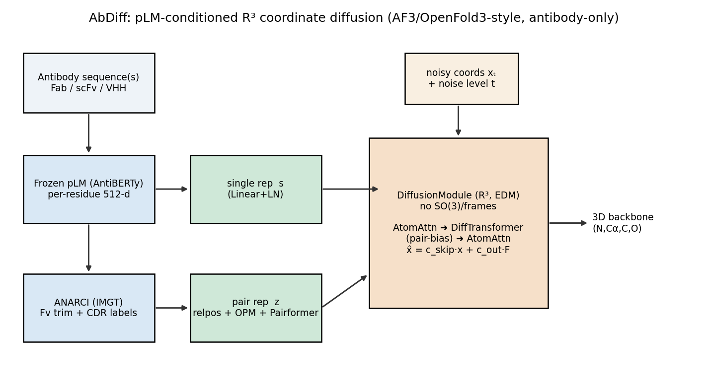

```
sequence ─► AntiBERTy (frozen, 512-d) ─► single rep s ─┐
         └► ANARCI (IMGT) Fv-trim + CDR labels          ├─► DiffusionModule (R³, EDM) ─► backbone x̂
  relpos + outer-product + Pairformer ─► pair rep z ─────┘   (atom-attn ▸ diff-transformer ▸ atom-attn)
            noisy coords xₜ , noise level t  ───────────────►
```

- **No SO(3) / frames.** Coordinates are denoised directly in R³ with EDM preconditioning
  (`x̂ = c_skip(t)·xₜ + c_out(t)·F`). Global pose freedom is handled by random-rotation augmentation
  of the target plus a Kabsch-aligned loss — not by manifold diffusion.
- **Frozen pLM trunk.** All sequence/evolutionary knowledge comes from AntiBERTy; the 14.5M-param
  diffusion network only learns embedding → geometry. (Swappable: ESM2, AbLang2, IgBert.)
- **Format-agnostic.** Fab = 2 chains (asym 0/1), scFv = 1 chain with 2 V-domains, VHH = 1 chain —
  all expressed purely through per-token `asym_id` / `residue_index` features.

## Results

Full 200-step rollout from noise, framework-superposed, best-of-4. Bars are **mean ± 95% CI**.

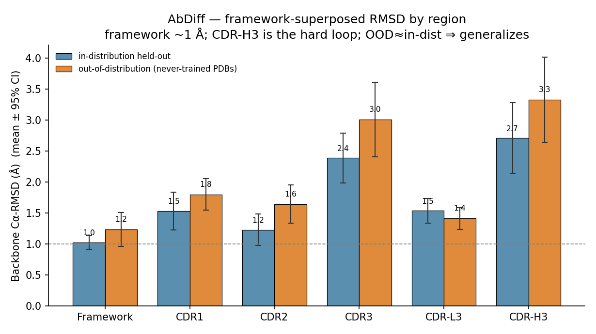

| Region | In-distribution held-out (n=30) | **OOD — never-trained PDBs** (n=56) |
|---|---|---|
| Framework | 1.0 | 1.2 |
| CDR-L3 | 1.5 | 1.4 |
| CDR-1 / CDR-2 | 1.5 / 1.2 | 1.8 / 1.6 |
| **CDR-H3** | **2.99** | **3.37** |

**Two honest takeaways:**
1. The conserved framework is *easy* (~1 Å); whole-Fv RMSD is flattered by it. The number that
   matters is **CDR-H3 ≈ 3 Å** — the long, hypervariable, binding-critical loop every antibody method
   is judged on. AbDiff is *single-sequence* (no MSA), so ~3 Å H3 is a reasonable starting point.
2. **It generalizes.** On a disjoint set of antibodies (>3.5 Å SAbDab entries — entirely different
   PDBs from the 9,119 trained on), CDR-H3 only rises 2.99 → 3.37 Å (overlapping CIs), and the OOD
   set has softer ground-truth coordinates, so the true gap is even smaller. Not memorization.

### Predicted (blue) vs native (gray), CDR-H3 in red/orange — PyMOL ray-traced, framework-superposed
| | | |
|---|---|---|
| 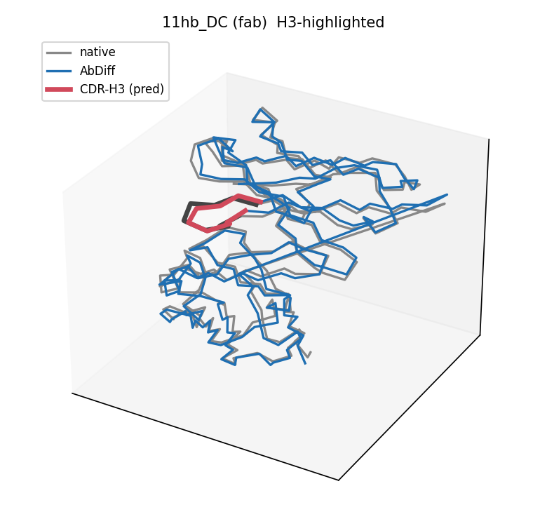 | 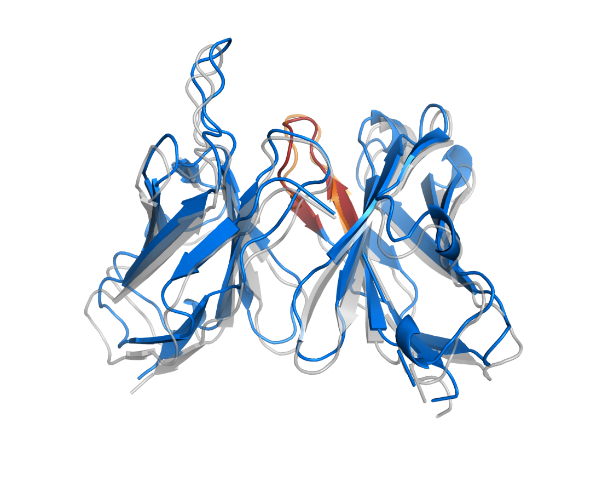 | 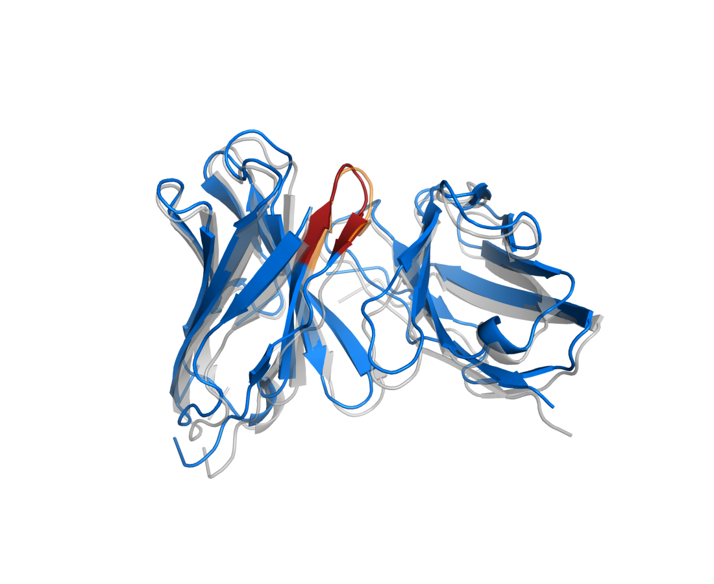 |
| Fab, H3 ≈ 0.8 Å | Fab, H3 ≈ 0.9 Å | Fab, H3 ≈ 1.1 Å |
| 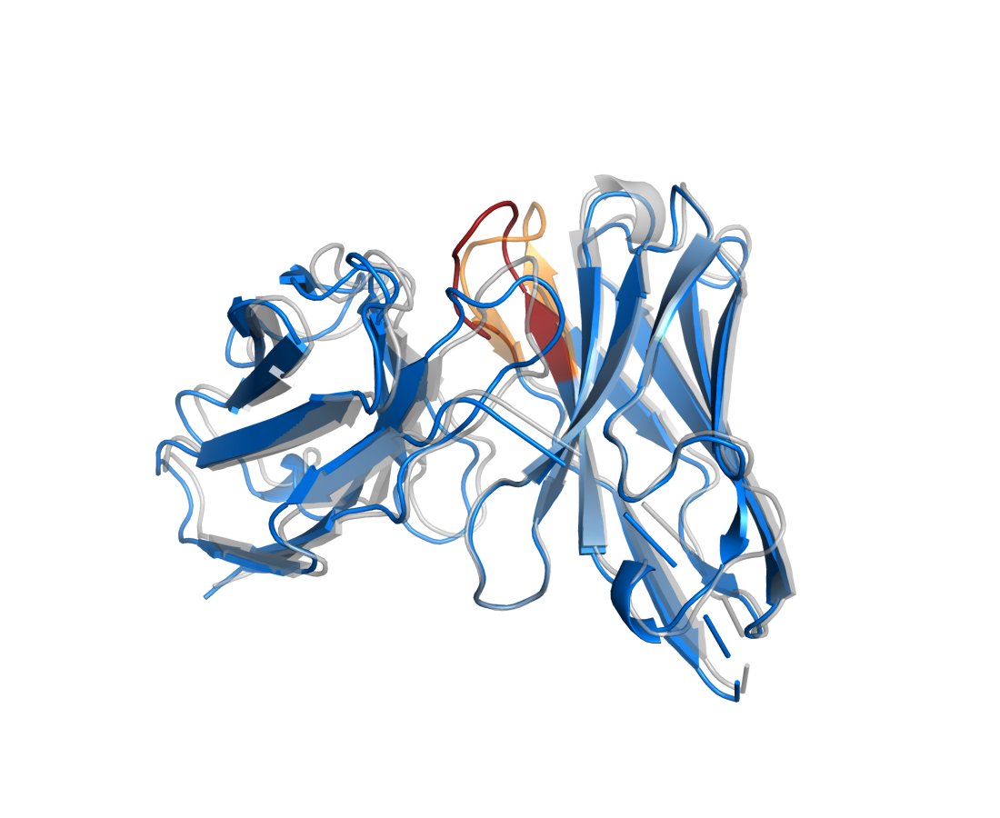 | 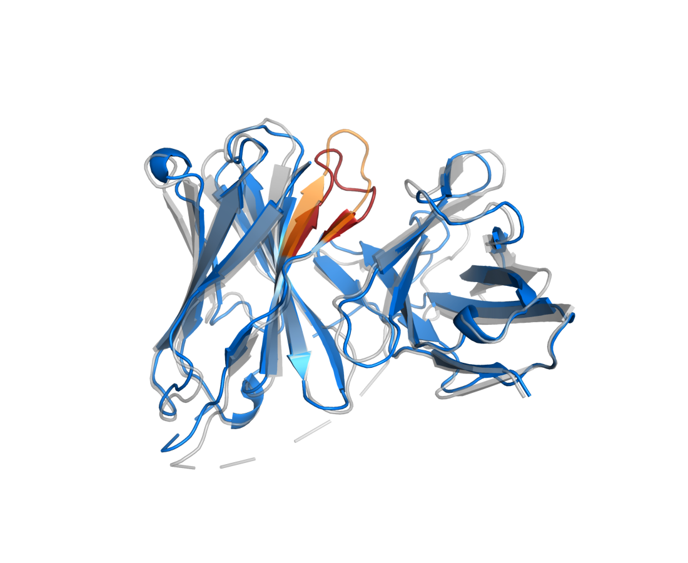 | 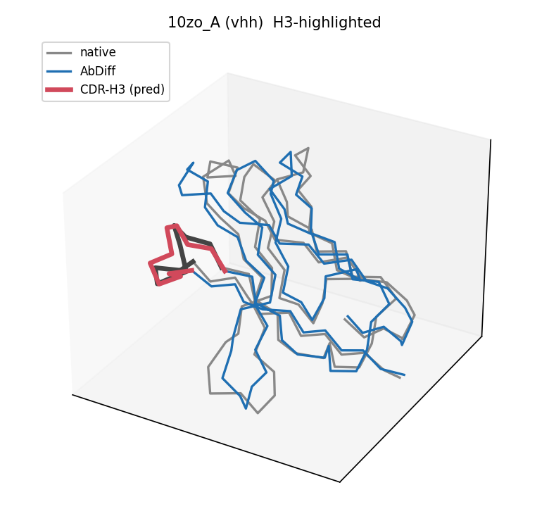 |
| Fab, H3 ≈ 2.1 Å | Fab, H3 ≈ 1.7 Å | **VHH/nanobody**, H3 ≈ 1.4 Å |
| 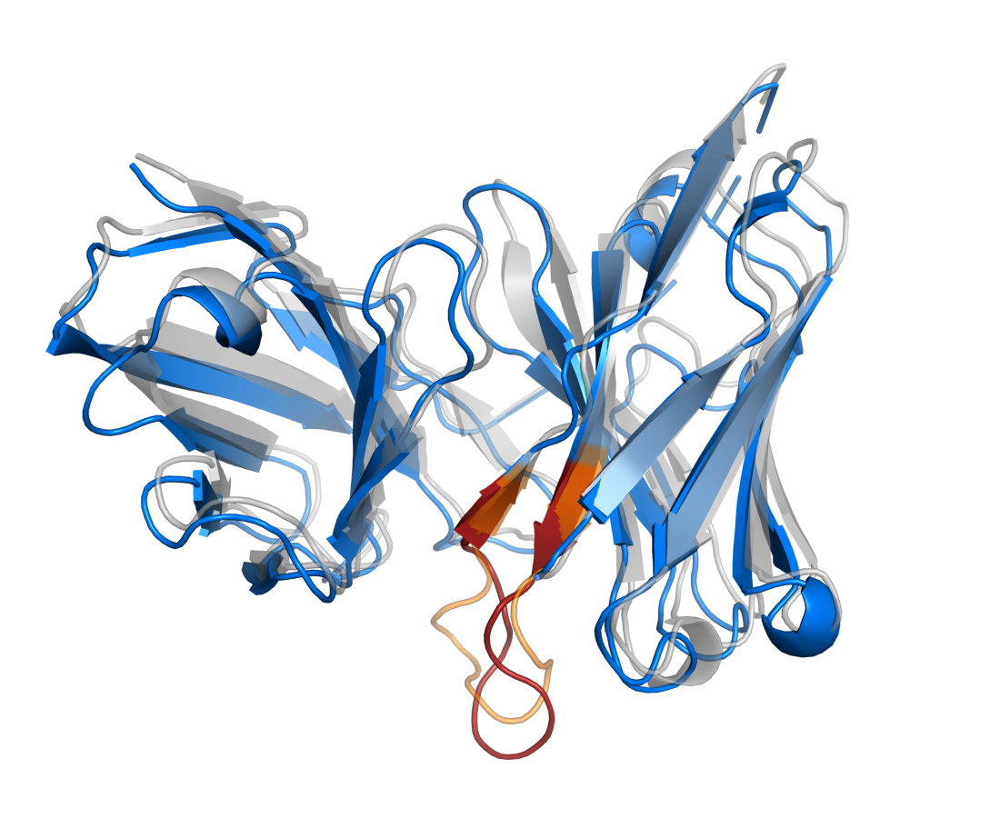 | 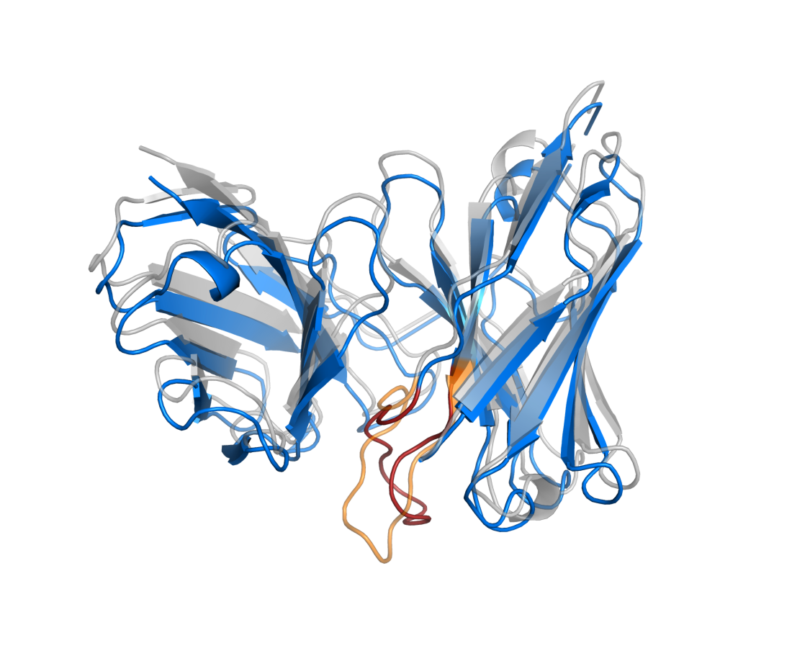 | 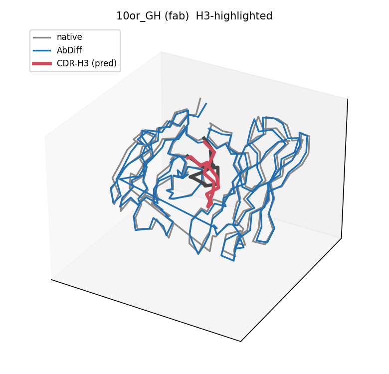 |
| Fab, H3 ≈ 2.2 Å | Fab, H3 ≈ 6.1 Å (hard) | Fab, H3 ≈ 6.2 Å (hard) |

The β-sandwich framework superposes tightly across all cases; CDR-H3 is where prediction and native diverge.

### Benchmarks
The framework-superpose → per-CDR harness (`abdiff/eval/bench_*`) scores any folder identically.
MSA-based **Boltz-2** / **OpenFold3** (weights on disk) and the single-seq **ESMFold** baseline are
the intended comparisons; ESMFold currently blocked by cross-env deps, Boltz/OF3 pending an MSA pass.

## Caveats / honest limitations
- **Backbone-only** (N, Cα, C, O), **Fv region** (constant domains trimmed by ANARCI).
- **Redundancy / leakage**: the in-distribution split is by file prefix and SAbDab is redundant.
  The OOD test above (disjoint PDBs) shows only a small H3 increase, but a sequence-**clustered**
  split is the gold standard and is the next evaluation.
- Headline RMSDs are **best-of-4 samples** (no confidence head yet); single-sample is higher.

## Install
```bash
pip install -r requirements.txt          # torch, antiberty, anarci, biotite<0.39, matplotlib
conda install -c bioconda hmmer          # ANARCI needs `hmmscan` on PATH
export ABDIFF_ROOT=$PWD                   # data/ and checkpoints/ live here
```

## Usage
```bash
# 1. data: SAbDab summary -> corpus -> CIFs -> ANARCI-trimmed Fv tensors (AntiBERTy emb + CDR labels)
python abdiff/data/build_corpus_sabdab.py            # needs sabdab_summary_all.tsv
python abdiff/data/prefetch_cif.py                   # download mmCIFs (needs internet)
python abdiff/data/prep_structures_anarci.py --device cuda    # -> data/train_sabdab_cdr/*.pt

# 2. train (fp32; periodic checkpoints + in-loop generation eval)
python abdiff/train.py --data data/train_sabdab_cdr --ckpt-dir checkpoints \
       --epochs 150 --bs 8 --save-every 20 --eval-every 20

# 3. evaluate (full rollout, per-CDR RMSD, CDR-H3 headline)
python abdiff/eval/eval_sample.py --ckpt checkpoints/abdiff_best.pt --data data/train_sabdab_cdr

# 4. figures
python scripts/make_figures.py                       # performance bar chart + architecture
python scripts/render_overlays.py --pdb-dir <pdbs> --truth data/bench_truth.pt \
       --ids 11hb_DC 10or_GH                          # PyMOL ray-traced structure overlays
```
SLURM examples for a Savio-style cluster are in `slurm/` (sharded prep array, training, eval).

## Repo layout
```
abdiff/
  model.py                     # AbDiffusion (EDM R³ diffusion) + sampler + Kabsch-aligned loss
  train.py                     # fp32 training, periodic ckpts, in-loop generation eval
  data/
    build_corpus_sabdab.py     # SAbDab summary -> fab/scfv/vhh corpus
    prefetch_cif.py            # mmCIF download
    prep_structures.py         # biotite parse + AntiBERTy embedding helpers
    prep_structures_anarci.py  # ANARCI Fv-trim + per-residue IMGT CDR labels
  eval/
    eval_sample.py             # rollout + framework-superposed per-CDR RMSD
    eval_checkpoints.py        # gen-RMSD vs training epoch
    bench_prep_truth.py        # held-out truth bundle for external folders
    bench_esmfold.py           # ESMFold baseline (single-seq)
    eval_ours_truth.py         # AbDiff on the shared truth bundle
configs/default.yaml · slurm/ · scripts/make_figures.py · assets/
```

## Acknowledgements
Diffusion design follows **AlphaFold3** (Abramson et al., 2024) and **OpenFold3** (AlQuraishi Lab /
OpenFold consortium). Built on **AntiBERTy** (Ruffolo et al.), **ANARCI** (Dunbar & Deane), and
**SAbDab** (Dunbar et al.). Apache-2.0.
